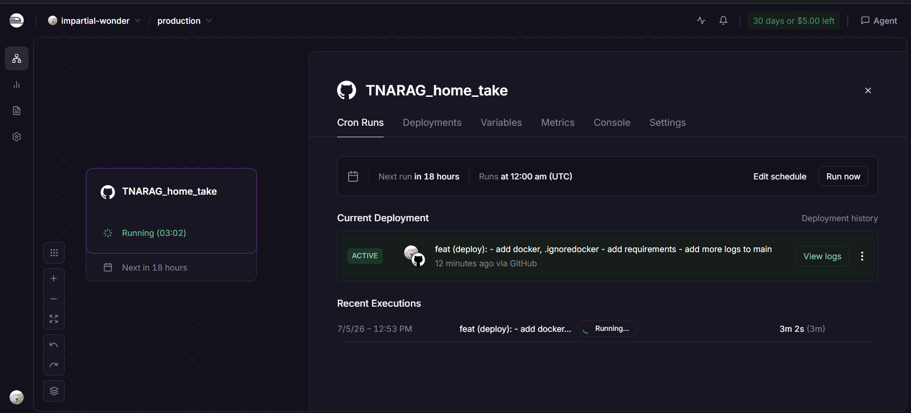
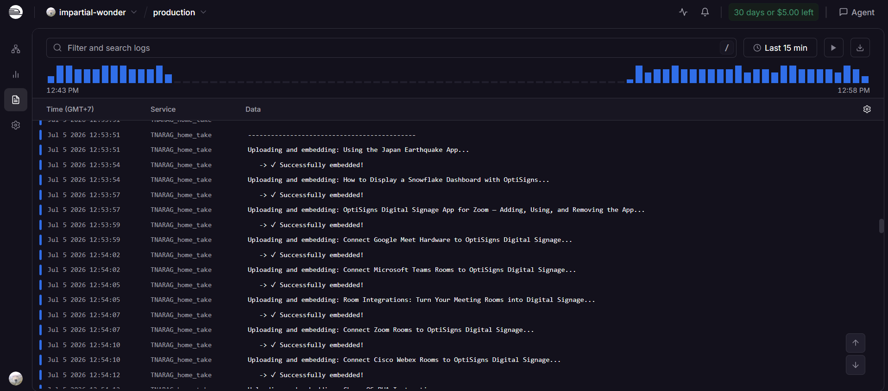
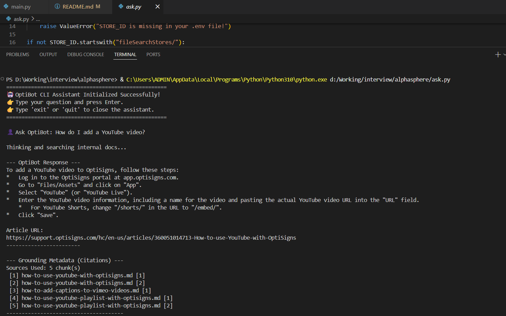

# RAGTNA

This is a small knowledge-base pipeline for OptiSigns support content. It:

- pulls Zendesk Help Center articles,
- converts each article to Markdown,
- stores article metadata locally in `metadata.json`,
- uploads the generated Markdown files into a Gemini File Search store,
- and provides a CLI assistant for asking questions against the uploaded docs.

## Setup

### Requirements

- Python 3.10+
- A Gemini API key
- An existing Gemini File Search Store ID

### Install dependencies

```bash
python -m venv .venv
.venv\Scripts\activate
pip install -r requirements.txt
```

### Configure environment variables

Copy `.env.example` to `.env` and fill in your values:

```env
GEMINI_API_KEY=your_api_key_here
STORE_ID=your_store_id_here
OUTPUT_DIR=output
METADATA_FILE=state/metadata.json
```

If you deploy on Railway, point `METADATA_FILE` to a path inside a mounted volume so the skip state survives container restarts.

If you do not already have a File Search Store, you can temporarily uncomment `init_knowledge_base()` in `main.py`, run the ingestion once, then copy the printed store name into `STORE_ID`.

## How to run locally

### 1. Build the local knowledge base

Run the ingestion script to fetch Zendesk articles, write Markdown files, and upload them to the File Search store:

```bash
python main.py
```

This generates Markdown files in `output/` and updates `metadata.json` so repeated runs can skip unchanged articles.

### 2. Ask questions in the CLI assistant

After the knowledge base is ready, start the interactive assistant:

```bash
python ask.py
```

Then type a support question and press Enter. Use `exit` or `quit` to close the assistant.

## Run with Docker

This repository includes a Docker image definition in `dockerfile`.

### Build the image

```bash
docker build -f dockerfile -t ragtna .
```

### Run the container

Make sure your `.env` file is available in the project root, then run:

```bash
docker run --rm --env-file .env ragtna
```

The container runs `python main.py`, so it will fetch the articles, regenerate Markdown output, and upload them to the configured File Search store.

If you want to run the interactive assistant inside Docker instead, you can override the command:

```bash
docker run -it --rm --env-file .env ragtna python ask.py
```

## Daily job logs

Daily job logs: 





This is a daily jobs log, but since it's on Railway, I can't share it. Sorry!

## Screenshot

Screenshot of the assistant answering a sample question:



## Chunking

This project does not implement custom chunking in code. Uploading files through Gemini File Search uses the platform's automatic chunking and indexing behavior.

You can see the effect of that in `ask.py`, which prints grounding metadata and reports the retrieved chunks used for a response. In other words, chunking is handled automatically by Google AI Studio / Gemini File Search rather than by a manual splitter in this repository.

## Project files

- `scraper.py` fetches Zendesk articles.
- `markdown.py` converts articles to Markdown and maintains `metadata.json`.
- `uploader.py` uploads Markdown files into the File Search store.
- `main.py` orchestrates fetch -> save -> upload.
- `ask.py` is the interactive CLI for querying the uploaded documents.
